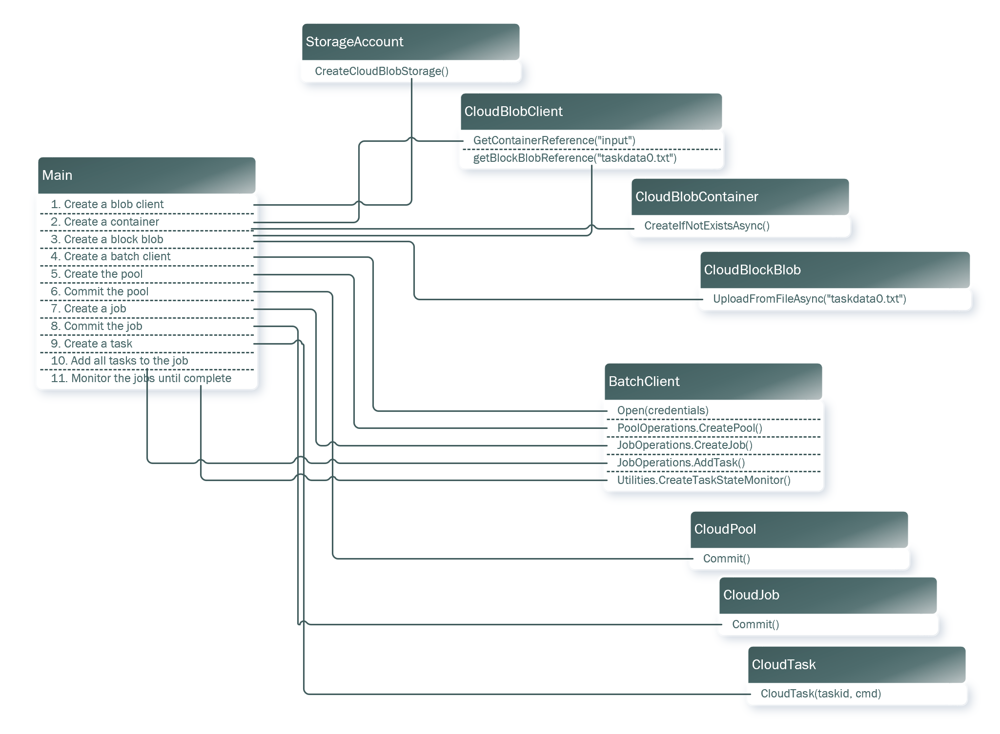

Azure Batch Quickstart

https://docs.microsoft.com/en-us/azure/batch/quick-run-dotnet

Exercise
https://docs.microsoft.com/en-us/learn/modules/run-parallel-tasks-in-azure-batch-with-the-azure-cli/4-exercise-create-azure-batch-job-in-cli-to-run-parallel-task

https://docs.microsoft.com/en-us/learn/modules/run-parallel-tasks-in-azure-batch-with-the-azure-cli/5-exercise-monitor-azure-batch-job-in-cli

https://docs.microsoft.com/en-us/learn/modules/run-parallel-tasks-in-azure-batch-with-the-azure-cli/6-introducing-batch-explorer

https://docs.microsoft.com/en-us/learn/modules/run-parallel-tasks-in-azure-batch-with-the-azure-cli/7-exercise-monitor-and-visualize-batch-job-in-batch-explorer